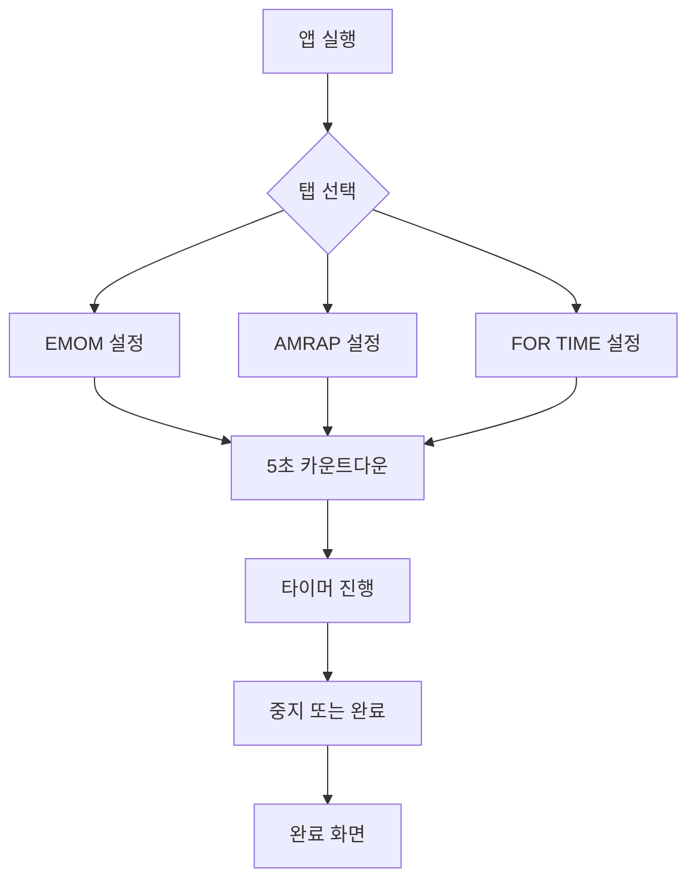

# work-out-timer

SwiftUI로 만든 HIIT 타이머 앱입니다.

## 주요 기능
- EMOM: 인터벌 + 총 시간, 운동 목록 순환(쉼표 구분).
- AMRAP: 총 시간, 운동 목록 표시(줄바꿈), 실행 중 더블탭으로 라운드 +1, 끝 알람 토글.
- FOR TIME: 총 시간 제한, 운동 목록 표시(줄바꿈), 중지 시 소요 시간 표시.
- EMOM Live Activity 지원.
- 위젯 확장(세그먼트 탭 프리뷰).
- Apple Watch 앱 제공(EMOM/AMRAP/FOR TIME 화면 + 심박 측정).
- iPhone ↔ Apple Watch 실시간 연동 상태/핑 테스트 표시.
- iPhone 타이머 시작 시 워치에 동일한 시간/운동 정보 표시.

## 기능 설명
- 시작 흐름: 시작 버튼 → 5초 카운트다운 → 타이머 시작.
- EMOM: 설정한 분마다 라운드가 1씩 올라가고, 해당 라운드의 운동이 표시되며, 매 분 끝에 삐 소리가 납니다.
- AMRAP: 고정 시간 카운트다운, 운동 목록 전체 표시, 더블탭으로 라운드 체크, 끝 알람 선택.
- FOR TIME: 목표 시간까지 카운트업(또는 중지 시 종료), 소요 시간 표시.
- 완료 화면: 완료 표시 + 다시 시작 버튼. AMRAP은 완료 라운드 표시.

## 스크린샷
- EMOM 설정 화면
- EMOM 진행 화면(현재 동작 표시)
- AMRAP 설정 화면(끝 알람 체크박스 포함)
- AMRAP 진행 화면(라운드 + 더블탭 안내)
- FOR TIME 진행 화면(경과 시간)

## 화면 흐름


## 프로젝트 구조
- `timer/ContentView.swift`: 앱 쉘 + 탭 전환
- `timer/EmomTabView.swift`: EMOM UI + 타이머 로직
- `timer/AmrapTabView.swift`: AMRAP UI + 타이머 로직
- `timer/ForTimeTabView.swift`: FOR TIME UI + 타이머 로직
- `timer/SettingsView.swift`: 워치 연동 상태/핑/심박 확인 설정 화면
- `timer/HeartRateManager.swift`: 워치 연결 + 심박/타이머 동기화 처리
- `timer/TimerTheme.swift`: 공통 컬러
- `timer/TimerUtilities.swift`: 공통 유틸
- `HIITWidgetExtension/`: WidgetKit 확장
- `Shared/HIITActivity.swift`: Live Activity 속성
- `timerWatchExtension/`: 워치 앱(타이머 UI + 심박 수집)

## 빌드/실행
1. Xcode에서 `timer.xcodeproj` 열기
2. `timer` 스킴 선택
3. 시뮬레이터 또는 디바이스에서 실행
4. 워치 앱 확인 시 `timerWatch` 스킴 선택

CLI 빌드:
```
xcodebuild -project timer.xcodeproj -scheme timer -sdk iphonesimulator -configuration Debug build
```

## 참고
- 알림 허용이 필요합니다(끝 알람).
- AMRAP 라운드는 실행 화면 더블탭으로 수동 체크합니다.
- 워치 연동은 iPhone/Watch 모두 앱이 실행 중일 때 실시간 표시가 됩니다.
